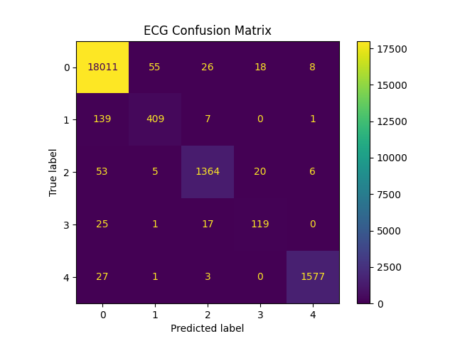

# ECG Signal Classification using Deep Learning

This project implements a 1D Convolutional Neural Network (CNN) for ECG signal classification using the MIT-BIH Arrhythmia dataset.

## Overview

The model learns patterns in biomedical time-series signals to classify different types of heartbeats.

## Results

* Test Accuracy: **98.12%**
* Strong performance on majority classes
* Confusion matrix analysis reveals minor misclassification in imbalanced classes

## Example Output



## Tech Stack

* Python
* PyTorch
* NumPy
* Matplotlib

## Key Concepts

* Time-series analysis
* 1D CNN for signal processing
* Biomedical data classification

## Dataset

MIT-BIH Arrhythmia Dataset: https://www.kaggle.com/datasets/shayanfazeli/heartbeat/code

## How to Run

```bash
pip install -r requirements.txt
python src/train.py
python src/evaluate.py
```

## Author

Maria Dimou

